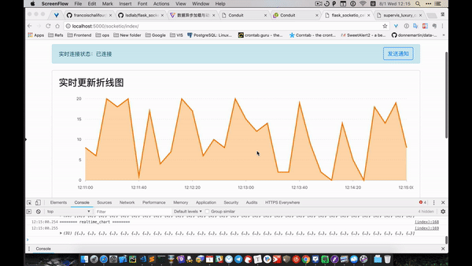

# flask_socketio_celery

flask + socketio + celery 实时更新应用的示例

需要用websocket，我还是得挑我熟悉的 Django，但是研究了一圈发现，Django + Channels 坑很大，把同步和
异步结合到一个 HTTP Server 里面是很麻烦的事情，部署也不一样了，最后还是选择了 flask-socketio 这个方案，
但是用下来发现 flask 也很坑，很多地方细节并没有 Django 那么方便，ORM sqlalchemy 语句也没那么直观，
还不太后台，总之就是用不来，但有迫于 Django 配合 websocket 用起来很蛋疼，也就只能用 flask 了。

这个示例结合了 flask-socketio 和 celery 后台任务，示例是一个实时更新的折线图，每十秒通过 socketio 发送到前端，
前端再更新数据。

展示的效果不是很好，但是意思没错

部署的话也很简单，可以直接 flask run，因为根据 flask-socketio 的文档，他封装的已经是 production ready 的了，
如果你还是想用 gunicorn 配合 nginx 的话也很简单，参考 [flask-socketio](https://flask-socketio.readthedocs.io/en/latest/)
的 Deployment 就可以了，nginx 开一个端口，然后代理到 gunicorn 就可以了，然后把这些东西都配置到 supervisor 里面就可以了。

## License
